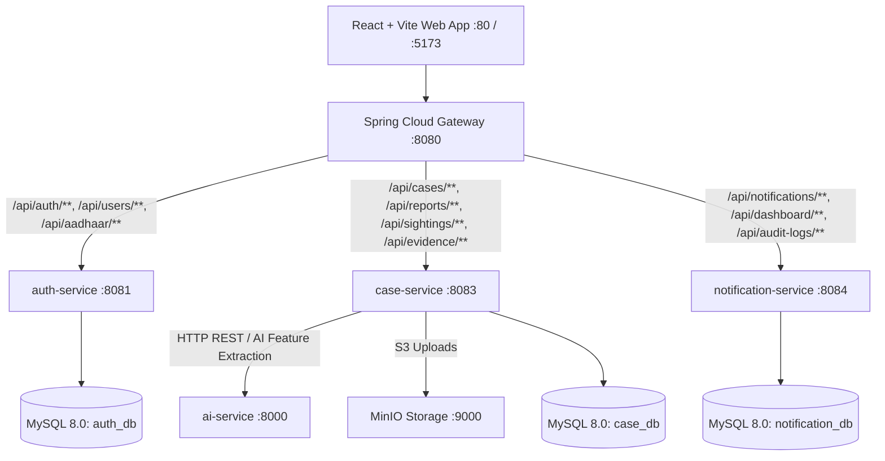

# MISXMATCH — AI-Based Missing Person Search & Reunification Platform

[]()
[]()
[]()
[]()
[]()
[]()

---

## 📌 Executive Overview

**MISXMATCH** is a multi-tier, AI-assisted humanitarian search and reunification platform engineered to accelerate the discovery, verification, and reuniting of missing persons. It integrates multi-modal AI biometric matching (512-d facial embedding cosine similarity, Person Re-ID, NLP sentence transformers, structured document OCR) with strict **Human-in-the-Loop (HITL)** governance, role-based access control, and complete auditability.



---

## 🏗 Microservice Ownership & Architecture

| Service Name | Technology Stack | Port | Database / Storage | Responsibility |
| :--- | :--- | :--- | :--- | :--- |
| **`gateway-service`** | Java 21, Spring Cloud Gateway | `8080` | N/A | Central API Gateway, JWT validation, CORS, request routing. |
| **`auth-service`** | Java 21, Spring Boot, Spring Security | `8081` | MySQL (`auth_db`) | Identity, registration, login, JWT refresh tokens, OTP, Aadhaar, org approval. |
| **`case-service`** | Java 21, Spring Boot, JPA, MinIO SDK | `8083` | MySQL (`case_db`) | Missing/Found reporting, Sightings, Evidence upload, CCTV analysis, AI candidate generation. |
| **`notification-service`** | Java 21, Spring Boot | `8084` | MySQL (`notification_db`) | In-app notifications, emergency broadcasts, audit logging, system health monitoring. |
| **`ai-service`** | Python 3.11, FastAPI, OpenCV, PyTorch | `8000` | Volatile / In-Memory | 512-d SFace & ArcFace embeddings, OSNet Re-ID, NLP text similarity, Risk scoring, OCR. |
| **`frontend`** | React 18, Vite, Nginx | `80` / `5173` | Local Storage | Multi-role user portal (Public, Police, Hospital, NGO, Admin). |

---

## ⚙️ Prerequisites & Environment Variables

### System Prerequisites
* **Docker Engine** `v24.0+` & **Docker Compose** `v2.20+`
* **Java Development Kit (JDK)** `21+` & **Apache Maven** `3.9+`
* **Python** `3.10+` with `pip`
* **Node.js** `18+` & `npm`

### Environment Configuration (`.env`)
Copy `.env.example` to `.env` before building or launching the environment:

```bash
cp .env.example .env
```

| Variable Name | Default Value | Description |
| :--- | :--- | :--- |
| `MYSQL_ROOT_PASSWORD` | `root` | Root password for MySQL 8.0 database engine. |
| `MYSQL_USER` | `root` | Database user account. |
| `MYSQL_DATABASE` | `misxmatch_db` | Primary database name. |
| `JWT_SECRET` | `misxmatch-super-secret-signing-key...` | HMAC-SHA256 JWT signing secret (min 32 chars). |
| `AI_SERVICE_KEY` | `misxmatch-internal-ai-service-secret...` | Inter-service security authentication token. |
| `OTP_MODE` | `development` | OTP mode (`development` logs to console, `production` uses SMTP). |
| `CORS_ALLOWED_ORIGINS` | `http://localhost:5173,http://localhost:80` | Allowed origin domains for CORS policy. |
| `MINIO_ACCESS_KEY` | `minioadmin` | MinIO root access key. |
| `MINIO_SECRET_KEY` | `minioadmin` | MinIO root secret key. |

---

## 🚀 One-Command Local Startup (Docker Compose)

Launch the complete stack (all 8 containers) using single canonical Docker Compose:

```bash
docker compose up --build -d
```

To view live container logs:
```bash
docker compose logs -f
```

To stop all services and preserve data volumes:
```bash
docker compose down
```

---

## 🧪 Comprehensive Verification & Test Commands

### 1. Backend Microservices Unit & Integration Tests (Java)
Runs all 56 Spring Boot unit and integration tests across microservices using in-memory H2 test environment:

```powershell
mvn clean test
```
*Expected Result: 56 tests run, 0 failures, 0 errors.*

### 2. Python AI Service Test Suite (Pytest)
Runs all 43 AI biometric, NLP, multi-factor matching, risk scoring, and OCR tests:

```powershell
& "c:\Users\MOUNA1822\Downloads\MISXMATCH_BACKEND LAST\.venv\Scripts\python.exe" -m pytest
```
*Expected Result: 43 passed.*

### 3. Frontend Web Application Production Build
Builds the Vite React application:

```bash
cd "MISXMATCH BACKEND 11/MISXMATCH_FRONTEND 12/MISXMATCH"
npm run build
```
*Expected Result: Clean minified production output in `dist/`.*

---

## 👥 Demo Accounts & Role-Based Access Control (RBAC)

The system enforces strict RBAC across 5 distinct authorization roles:

| Role | Username / Email | Password | Allowed System Capabilities |
| :--- | :--- | :--- | :--- |
| **Public User** | `user1@example.com` | `User@123` | Submit missing/found reports, report sightings, track personal reports. |
| **Police Officer** | `officer.verma@police.gov.in` | `Police@123` | Case management, review AI match candidates, CCTV analysis, verify sightings. |
| **Hospital Admin** | `admin@cityhospital.org` | `Hospital@123` | Register unknown/unclaimed patient intake records, check AI candidate matches. |
| **NGO / Shelter** | `shelter@hopehome.org` | `NGO@123` | Intake missing children/resident records, search reunification directory. |
| **Super Admin** | `admin@misxmatch.org` | `Admin@123` | User management, organization verification approvals, audit logs, health metrics. |

---

## 📚 API Documentation & Postman Collection

* **Central Gateway OpenAPI UI**: `http://localhost:8080/swagger-ui.html`
* **Python AI Microservice Docs**: `http://localhost:8000/docs`
* **Postman Collection**: `MISXMATCH_POSTMAN_COLLECTION.json` (located at repository root)

---

## 🗄 Database Initialization & Schema Strategy

Database migrations and schemas are auto-initialized upon first MySQL container startup via entrypoint scripts in `MISXMATCH BACKEND 11/MISXMATCH 10/mysql-init/`:
1. `init.sql`: Creates `auth_db`, `case_db`, and `notification_db`.
2. `seed_data.sql`: Creates core relational tables (`users`, `profiles`, `organizations`, `missing_persons`, `found_persons`, `sightings`, `ai_matches`, `notifications`, `audit_logs`).
3. `ai_safety_schema.sql`: Initializes additive AI governance tables (`ai_quality_assessments`, `ai_candidate_leads`, `ai_temporal_tracks`, `ai_audit_events`, `ai_feedback`, `ai_retention_policies`).

---

## ✅ Verified Feature Checklist

### Verified Working & Fully Implemented
* [x] **User Registration, Login, JWT Refresh & Role Access**: Multi-role authentication with OTP fallback.
* [x] **Missing Person Reporting & Photo Upload**: Field validation, image storage (MinIO with local disk fallback).
* [x] **Found Person & Hospital Intake**: Structured intake forms for unknown patients and shelter residents.
* [x] **Sightings & Evidence Upload**: Citizen sighting submissions with geotagging and document evidence storage.
* [x] **Police Case Review & Status Transitions**: Case state machine (`OPEN`, `INVESTIGATING`, `VERIFIED`, `CLOSED`).
* [x] **AI Candidate Generation & Explainable Scoring**: 5-factor scoring (Face, Text, Attribute, Location, Time).
* [x] **Mandatory Human-in-the-Loop (HITL) Review**: Human officer approval required before match confirmation; reviewer ID and timestamp recorded.
* [x] **Notifications, Audit Logging & Health Monitoring**: Asynchronous notification dispatch, immutable audit events, system health endpoint.
* [x] **Admin Organization Approvals**: Super admin verification queue for police stations, hospitals, and NGOs.

### Mocked / Demo-Only Integration Points
* [!] **Aadhaar Verification**: Simulated hash lookup and mock OTP delivery for demonstration without external UIDAI dependency.
* [!] **Development OTP Delivery**: Prints OTP codes in server console when `OTP_MODE=development`.

### Intentionally Deferred Features
* [*] **Real-Time Video Stream Ingestion**: Live RTSP stream processing deferred to future edge-deployment milestone.
* [*] **GPU Hardware Acceleration**: System operates cleanly on CPU inference with optional CUDA runtime binding.

---

## 📝 Major Fixes Changelog

1. **Established Single Canonical Docker Compose**: Removed nested duplicate docker-compose files and unified all 8 containers into root `docker-compose.yml`.
2. **Scrubbed Plaintext Credentials**: Removed exposed MySQL passwords and SMTP keys from `application.yml` files; configured `.env.example`.
3. **Decoupled Identity & Authentication Architecture**: Restored `auth-service` (Port 8081) as canonical user service and removed duplicated `com.misxmatch.auth.*` classes from `case-service` (Port 8083).
4. **Standardized Database Separation**: Fixed JDBC connections across services to cleanly connect to `auth_db`, `case_db`, and `notification_db`.
5. **Fixed Gateway Routes**: Corrected Spring Cloud Gateway predicates to cleanly route identity requests to `auth-service` and case requests to `case-service`.
6. **Achieved 100% Pytest Pass Rate**: Implemented missing `POST /ocr`, `POST /embed/face`, `POST /embed/reid`, `POST /embed/text`, and `POST /match/text` endpoints in `ai-service`.
7. **Fixed Unit Test Database Autoconfiguration**: Added test `application.yml` with in-memory H2 database for `case-service` so all 56 Java unit tests pass out of the box.
8. **Fixed Nginx Container Port Mapping**: Updated Nginx configuration and Compose port mappings (`"80:80"`, `"5173:80"`).
